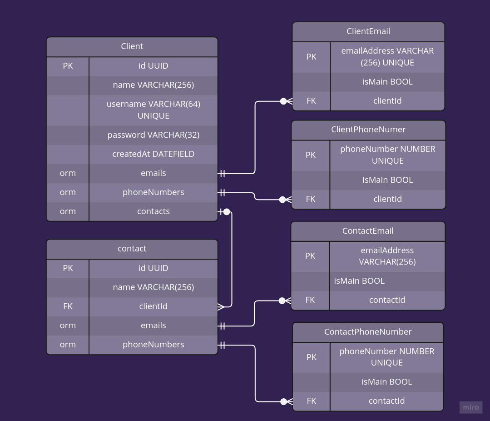

# client_registration_API

An API developed with the objective of practicing full stack skills. This means that it is a simple back end project with a simple front end to train the integration of them both. It allows client registration and each client can have multiple contacts. It also uses pdfkit to be able to generate a pdf with the client's information.

## Table of contents

- [Overview](#overview)
- [ER Diagram](#er-diagram)

## Overview

tecnologies:

- [NodeJS](https://nodejs.org/en/)
- [Express](https://expressjs.com/pt-br/)
- [Typescript](https://www.typescriptlang.org/)
- [PostgreSQL](https://www.postgresql.org/)
- [TypeORM](https://typeorm.io/)

## ER Diagram

